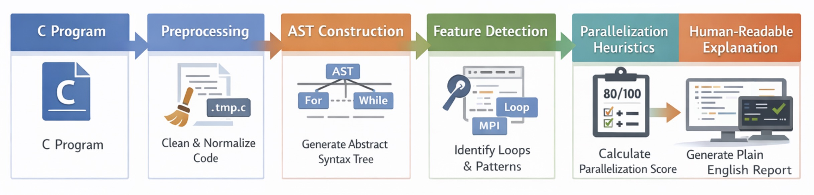

# Explain_C-AST
A python command line tool that attempts to explain C source code using the pycparser tool, using plain english.

Technologies used: python3, pycparser, pytest

This tool creates an AST(Abstract Syntax Tree) from the C program and dissects that to find out information about the program. It automatically strips comments from the source and has header files, so there are no errors when running it. For every for and while loop, this tool records the line number, nesting depth, and any function calls that occur within the loop.

Run it by typing: python3 Explain_C-AST.py 

Features so far:
- Strips comments from C source code
- Nested loop detection
- It detects some parallel program calls
- Puts the full AST into a separate file
- Basic loop parallelizable score
- Plain english explanations

You may test the program for correctness (no error code) with: "pytest -v".
It will run all of the test programs and indicate whether or not they ran correctly.