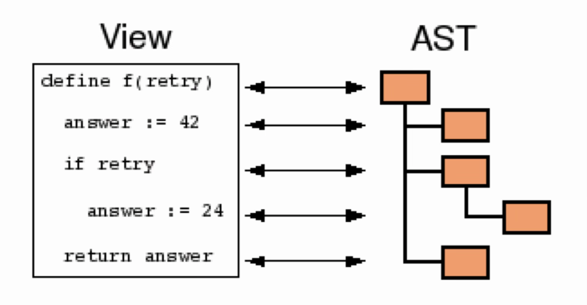

# Explain_C-AST
A python command line tool that attempts to explain C source code using the pycparser tool, using plain english.

Run it by typing: python3 Explain_C-AST <test_file.c>

Features so far:
- Strips comments from C source code
- nested loop detection
- it detects some parallel program calls
- prints the AST Tree