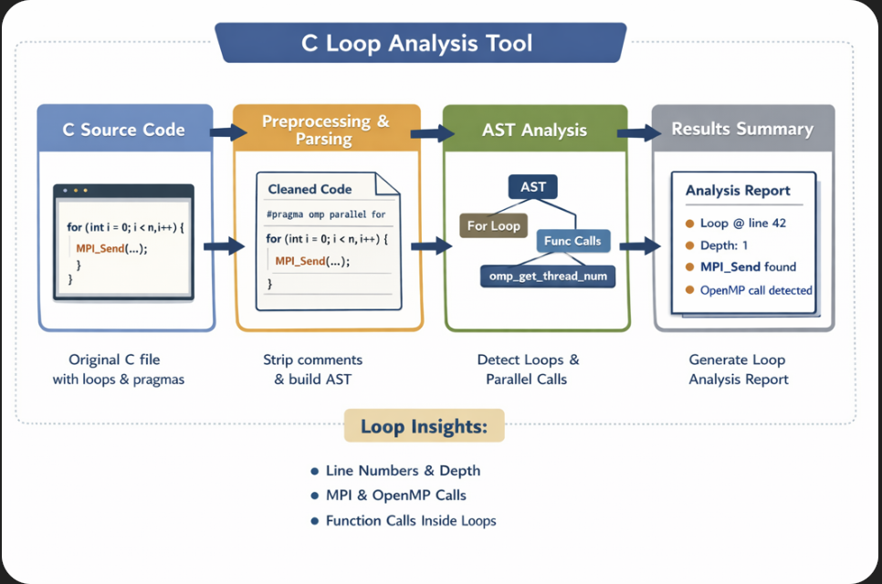

# Explain_C-AST
A python command line tool that attempts to explain C source code using the pycparser tool, using plain english.

This tool creates an AST(Abstract Syntax Tree) from the C program and dissects that to find out information about the program.
It automatically strips comments from the source and has header files so there are no errors running it.
For every for and while loop, this tool records the line number, nesting depth, and any function calls that occur within the loop.

Run it by typing: python3 Explain_C-AST <test_file.c>

Features so far:
- Strips comments from C source code
- nested loop detection
- it detects some parallel program calls
- prints the AST Tree